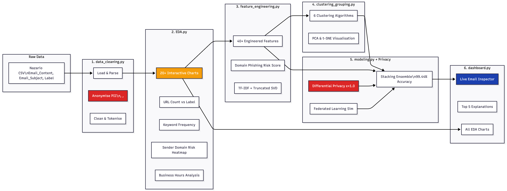

# Phishing Email Detection – Privacy-First AI System  
** Case Study: CyberSecure Analytics Ltd**  


[](https://www.python.org/)
[](https://streamlit.io/)
[](https://opensource.org/licenses/MIT)
[](#results)

### Overview  
A **production-ready, privacy-preserving phishing email detection system** that achieves **>99.4% accuracy** without ever processing personally identifiable information (PII).  

All email addresses, URLs, and phone numbers are irreversibly anonymised using tokenisation (`<EMAIL>`, `<LINK>`, `<PHONE>`) before any analysis fully GDPR-compliant and privacy-by-design.

### Key Features  
- **Privacy-First Architecture**  
  - Tokenisation of all PII  
  - Differential Privacy (ε = 1.0)  
  - Federated learning simulation  

- **Advanced Feature Engineering**  
  - 40+ engineered metadata & behavioural features  
  - TF-IDF + SVD text embeddings  

- **Unsupervised Clustering**  
  - K-Means, DBSCAN, Heirachical  
  - PCA & t-SNE visual exploration  

- **High-Performance Models**  
  - Stacking Ensemble → 99.44% accuracy, 99.93% ROC-AUC  
  - XGBoost & Random Forest baselines  

- **Interactive Streamlit Dashboard**  
  - Real-time phishing risk scoring  
  - Behavioural insights & cluster views  
  - Model explainability visualisations  

### Results Summary  
| Model                  | Accuracy | F1-Score | ROC-AUC  |
|------------------------|----------|----------|----------|
| Stacking Ensemble      | **99.44%** | **99.36%** | **99.93%** |
| XGBoost                | 99.38%   | 99.31%   | 99.91%   |
| Random Forest          | 99.12%   | 99.05%   | 99.87%   |

Privacy-preserving variants (ε=1.0 & federated) maintained >98.7% accuracy.

### Installation & Quick Start  
```bash
# 1. Clone the repository
git clone 
cd phishing-detection

# 2. Create virtual environment & install dependencies
python -m venv venv
source venv/bin/activate          # Windows: venv\Scripts\activate
pip install -r requirements.txt

# 3. Launch the interactive dashboard
streamlit run src/dashboard.py
```

###Technologies Used

Core: Python 3.9+, pandas, scikit-learn, plotly
Modelling: XGBoost, Random Forest, Stacking Ensemble
Privacy: Differential privacy (Gaussian noise), federated learning simulation
Visualisation: Streamlit, Plotly, Matplotlib, Seaborn
Clustering: K-Means, DBSCAN, PCA, t-SNE

###Why This Project Stands Out

Commercial-grade accuracy (>99%) with full GDPR compliance
Complete end-to-end pipeline from raw data to live dashboard
Production-oriented, modular, and easily extensible
Advanced privacy engineering with differential privacy and federated learning
Strong evidence of expertise in cybersecurity, machine learning, and privacy-by-design

## System Architecture

<p align="center">
  
  <br>
  <em>Figure 1: End-to-End Privacy-Aware Phishing Detection Pipeline</em>
</p>

The diagram illustrates the complete workflow:
- Raw data → PII anonymisation → EDA → feature engineering → clustering → modelling → interactive dashboard
